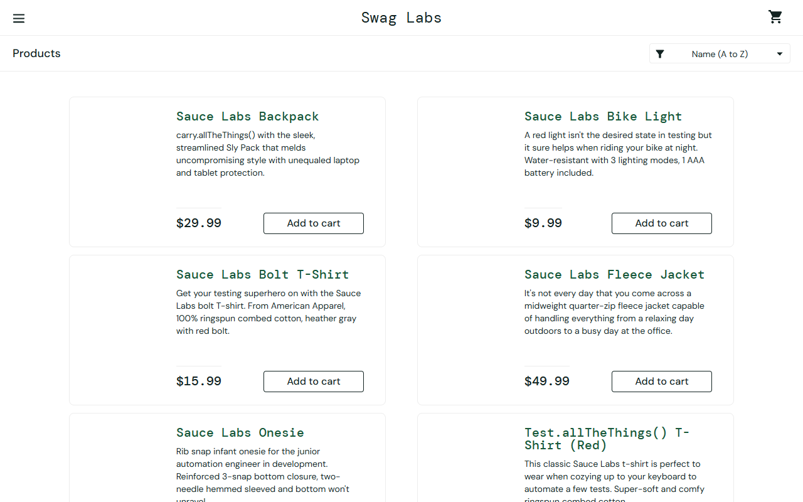
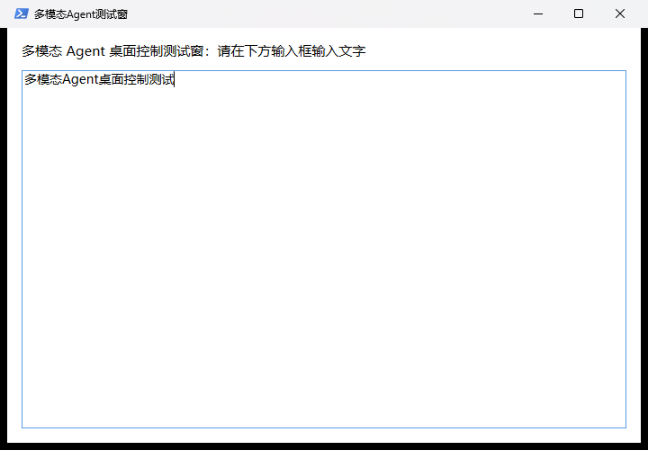

# Project-002-multimodal-agent

多模态 GUI Agent 本地项目：**DeepSeek 大脑 + 现成多模态 API 眼睛 + 手（Playwright 网页 / UIAutomation 桌面）**，可完成本地页面、**真实网页任务**与**桌面应用控制**。

## 目标
- 把「外挂式按需长眼睛」方案落地为可运行、可扩展的完整本地项目。
- 支持两种眼睛：`live`（现成多模态 API）与 `mock`（DOM 直读，离线自测/降级）。
- 支持两种大脑：`deepseek`（真实决策）与规则兜底（离线/降级）。
- 真实网页任务已验证：SauceDemo 登录并确认商品页（4 步完成）。
- 桌面控制已验证：启动自定义 WPF 测试窗 → 视觉识别 → DeepSeek 决策 → 安全输入 → 验证（4 步完成）。

## 演示结果

| 网页任务完成 | 桌面任务完成 |
| --- | --- |
|  |  |

## 输入 / 输出
- 输入：任务名或 URL + 任务描述（`node src/run.js <任务名或URL>`）
- 输出：`output/screenshots/<runId>/stepNN.png`（每步截图）、`output/reports/<runId>.json`（报告）、`data/logs/run-*.log`（日志）

## 快速开始
```powershell
git clone https://github.com/ChikawaAnon/multimodal-gui-agent.git
cd multimodal-gui-agent
.\scripts\setup.ps1        # 安装依赖 + 生成 .env（需先填 KIMI_API_KEY）

npm run self-test           # 离线自测（mock，不联网）
npm run task:local          # 本地测试页登录（live）
npm run task:sauce          # 真实网页：SauceDemo 登录（live）
node src/run.js https://example.com --task="..."   # 自定义 URL
npm run task:desktop      # 桌面：WPF 测试窗输入验证（live）
node src/run.js desktop:notepad   # 桌面：记事本输入验证（live）
```

## 架构
```
┌─ 大脑 src/brain.js（DeepSeek，纯文本决策）───────────┐
│  观察 → 输出 JSON 动作：click/type/scroll/wait/done   │
└──────────────┬────────────────────────────────────┘
               │
┌──────────────▼────────────────────────────────────┐
│ 眼睛 src/eyes.js（多模态 API） / src/mock.js（DOM）  │
│  截图 → {summary, state, elements:[{type,text,bbox}]}│
└──────────────┬────────────────────────────────────┘
               │
┌──────────────▼────────────────────────────────────┐
│ 手 src/hands.js（Playwright + Edge）                │
│  截图 / 点击（DOM优先+bbox兜底）/ 输入 / 滚动 / 验证   │
└───────────────────────────────────────────────────┘
```
主循环 `src/agent.js`：**感知 → 决策 → 执行 → 再感知验证 → done**，带无进展检测、最终 DOM 校验、报告归档。

## 桌面控制（界面类型 surface=desktop）
- 手：`src/hands-desktop.js`（PowerShell + UIAutomation/user32 + PrintWindow）
- 眼睛：对目标窗口用 PrintWindow 截图（即使被遮挡也能拍到），交给多模态 API
- 安全机制：桌面任务默认只允许 `type/wait/done`（白名单），输入前先验证目标窗口在前台（`TypeSafe`），绝不向其他窗口发送按键
- 内置任务：`desktop:demoapp`（自定义 WPF 测试窗，无会话恢复）、`desktop:notepad`（记事本）
- 已知注意：新版记事本有「会话恢复」，被强制结束后会恢复上次内容；demo 用 WPF 测试窗规避

## 成本优化（② 截图缓存 + ROI 裁剪）
- **截图缓存**：每步截图先算像素哈希，画面未变化则复用上次视觉结果，跳过视觉 API 调用。
- **ROI 裁剪（inspect）**：大脑需要精读某区域时发 `inspect`，程序把该区域裁剪放大再交给视觉模型，显著降 token。
- **实测**：ROI 单次裁剪节省约 58%~64% token；桌面/真实网页运行中均出现缓存命中（省 1 次/步）。
- 演示命令：`npm run demo:cost` / `npm run demo:cache` / `npm run demo:roi` / `npm run cost-test`

## 多任务队列 / 定时任务（③）
- **队列**：`src/queue.js` 顺序执行多个任务，支持按任务覆盖 `mode`（mock/live）、失败自动重试、继续执行不中断。
- **汇总报告**：每次队列输出 `output/reports/queue-<时间>.json`（每任务结果、尝试次数、总耗时、通过率）。
- **定时**：`scripts/schedule.ps1` 注册 Windows 计划任务每日定时跑队列（`-DryRun` 先预览）。注意计划任务在非交互会话运行，仅适合网页(headless)任务。
- 命令：`npm run queue` / `npm run queue:demo` / `npm run schedule:preview`

## 实测记录
- 离线自测（mock）：本地登录页 4 步成功 ✅
- 真实网页（live）：SauceDemo 登录 → Products 页，4 步成功 ✅（另一次遇到网络错误页，Agent 自动点刷新恢复后完成 ✅）
- 容错验证：视觉 JSON 截断 → 自动重试；DeepSeek 输出异常 → 重试/规则兜底；网络错误页 → 大脑识别并点击刷新。
- 成本优化验证：ROI 裁剪省 58%~64% token；缓存命中在真实运行中生效（如 SauceDemo 4 步只调 3 次视觉 API）。
- 队列验证：默认队列与文件队列均 2/2 通过（local-login mock + saucedemo live 混合模式，约 50s/轮）。

## 目录
```
multimodal-gui-agent/
  docs/architecture.md   # 架构与设计决策
  docs/usage.md          # 使用手册
  src/                   # config/eyes/brain/hands/hands-desktop/agent/run/tasks/logger/mock
  pages/demo.html        # 本地离线测试页
  test/offline.test.js   # 离线自测
  scripts/               # setup.ps1 / run.ps1 / desktop.ps1 / demo-app.ps1
  data/logs/             # 运行日志
  output/screenshots/    # 每步截图
  output/reports/        # 运行报告 JSON
  .env.example           # 环境变量模板
```

## 完成状态
✅ 项目已落地并通过验证（离线自测 + 真实网页任务）。下一步可扩展：桌面应用控制、截图缓存/ROI 成本优化、多任务队列。
## 已封装为 Skill
项目已封装为用户级 skill：multimodal-gui-agent（位于 ~/.codex/skills/multimodal-gui-agent），供没有多模态能力的模型调用：执行 scripts/run-task.js <任务> 即可驱动本项目完成网页/桌面 GUI 自动化。

